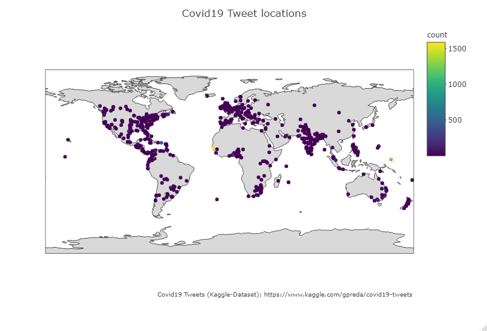

# Covid19Tweets
Kaggle-Task from https://www.kaggle.com/gpreda/covid19-tweets

# Task
Show the geographical distribution of Covid19 Tweets

# Solution
Using column "user_location" I match the location with those of world.cities from the "map"-package
Thes lat/long pairs I show on a world-map.

# Grouped by city
Directly matching user_location with lat/long results in about 10000 matches from over 81000 tweets. Taking only this data results in the following geographical distribution:

It is really hard to read, where a lot of tweets are coming from. What you can clearly see are areas, where no tweets are coming from. Keep in mind, this iis only 1/8 from all tweets.

# Todo
- improve matching between user_location and city (only around 10000 of 81000 tweets automatically matched)
